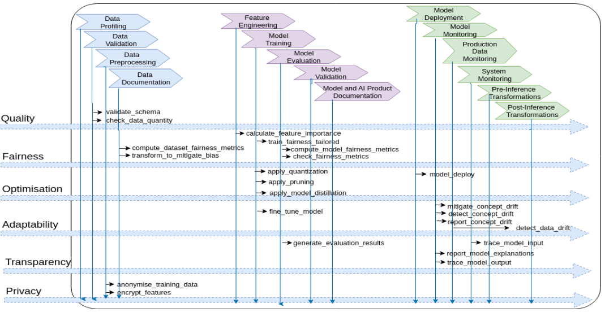

# Enhanced MLOps framework

The framework describes the necessary operations that explicitly operationalize AI system requirements, contributing to implement responsible, modular, and reusable AI systems. 


First, we enrich the life-cycle model with explicit and well-defined operations that have clear execution semantics and facilitate the automation of the underlying process. 
Second, we demonstrate how relevant crosscutting requirements and aspects, such as fairness, optimization, adaptability, robustness and transparency may be operationalized and aligned with the enhanced AI lifecycle operations. 

We show how the existing open source libraries and tools may be associated with this taxonomy, paving the way for modularity and reuse of these solutions across different contexts. 
Finally, we have developed a catalog of tools for implementing different requirements of an AI system.



## 📚 Citation

```bibtex
@article{celepija_towards_nodate,
	title = {Towards a structured {AI} development lifecycle for reusable {AI} products in the public sector},
	author = {Celepija, Albana and Lepri, Bruno and Kazhamiakin, Raman}
}
```