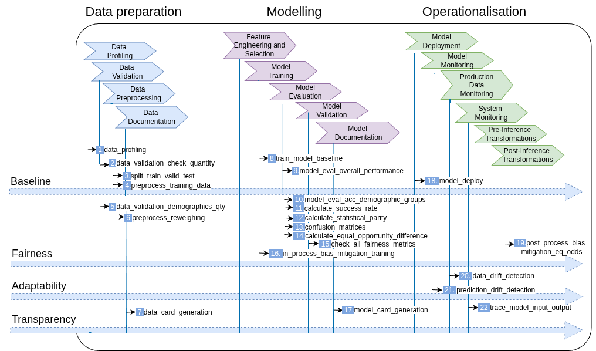

# Enhanced MLOps framework

This repository provides a framework and tooling to operationalize AI system requirements (fairness, robustness, optimization, transparency, etc.) across the ML lifecycle.
The framework describes the necessary operations that explicitly operationalize AI system requirements, contributing to implement responsible, modular, and reusable AI systems. 

First, we enrich the life-cycle model with explicit and well-defined operations that have clear execution semantics and facilitate the automation of the underlying process. 
Second, we demonstrate how relevant crosscutting requirements and aspects, such as fairness, optimization, adaptability, robustness and transparency may be operationalized and aligned with the enhanced AI lifecycle operations. 

We show how the existing open source libraries and tools may be associated with this taxonomy, paving the way for modularity and reuse of these solutions across different contexts. 
Finally, we have developed a catalog of tools for implementing different requirements of an AI system.



## 📦 Structure

```bash
enhanced_mlops/
├── framework/        # Core Python library + AI lifecycle implementation
├── guided_ui/        # Streamlit web app for interactive AI product management
├── tools_catalog/    # Catalog of open-source MLOps tools (code snippets, notebooks)
├── static/           # Images (framework diagram)
└── requirements.txt  # Python dependencies
```

## 1. framework/ — Core Library  
The intellectual heart of the project. Defines a structured AI lifecycle with typed artifacts and declarative specs.

### Key Concepts:
- **Three AI lifecycle stages** (defined in `config/pipeline_definitions.yaml`):
  - **Data Preparation**: `data_profiling`, `data_validation`, `data_preprocessing`, `data_documentation`
  - **Modelling**: `feature_engineering`, `model_training`, `model_evaluation`, `model_validation`, `model_documentation`
  - **Operationalization**: `model_deployment`, `model_monitoring`, `production_data_monitoring`, `system_monitoring`, `pre/post_inference_transformations`
- **Requirements dimensions**: baseline, fairness, robustness, optimization, privacy, transparency

- **Artifact Types**:
Defined in `src/artifact_types.py`:
Classes representing pipeline inputs/outputs:
  - `Data`, `Model`, `Report`, `Configuration`, `Status`, `Documentation`, `Function`, `Service`, `Logs`

- **Use Cases**: Located in `library/use_cases/`: Each includes `src/`, `metadata/`, `docs/`, and platform variants (`local_platform`, `dh_platform`).

- **Template**:
- **`aipc_template/`**: Scaffold for creating new AI products.

## 2. guided_ui/ — Streamlit Web Application
An interactive UI for exploring, creating, and managing AI products aligned with the framework.

### Pages:
- `app.py` (main page): Allows users to navigate lifecycle stages (Data Preparation → Modeling → Operationalization) via a stage menu, select an operation, view its implementation code (in an embedded Monaco/Ace editor), and run it. Also shows the tools catalog for each operation.
- `pages/1_dashboard.py`: Visual overview of all pipeline operations for a selected AI product, color-coded by requirement dimension compliance (green = implemented, red = missing, grey = excluded).
- `pages/2_new_aiproduct.py`: Wizard for creating new AI products from the template.


## - 3. tools_catalog/ — MLOps Tools Reference
A curated catalog of open-source tools for AI requirements:

- `CSV/Excel spreadsheets`: fairness_tools.csv, fairness_metrics.csv, robustness_tools.xlsx, tools_principles_catalog.csv — maps tools to lifecycle operations and requirements.
- `code_snippets/`: Python example scripts for tools like fairlearn, aif360, holisticai, alibi_detect, evidently, ydata_profiling, guardrails, etc.
- `tools.ipynb`: Jupyter notebook exploring the catalog.

## 📚 Citation

```bibtex
@article{enhanced_mlops,
	title = {Towards a structured {AI} development lifecycle for reusable {AI} products in the public sector},
	author = {Celepija, Albana and Lepri, Bruno and Kazhamiakin, Raman},
	year={2025},
	url = {https://ceur-ws.org/Vol-4109/paper7.pdf}
}
```